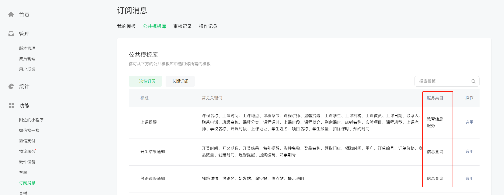

# 小程序订阅消息接入的开发指引

很多用户在接入小程序[订阅消息](https://developers.weixin.qq.com/miniprogram/dev/framework/open-ability/subscribe-message.html)时有一些疑问，认为订阅消息和客服消息一样，缺乏相关的内容支撑；因此本篇主要讲解一下如何接入订阅消息，并给出一些建议。

## 一、类目和订阅模板的选择

首先需要确认你的小程序想要发送什么类型的订阅消息，可以先进入[开发者后台](https://mp.weixin.qq.com/wxamp/newtmpl/mytmpl)选择需要的模板。


如果你没有找到需要的模板，可以尝试在设置中，调整一下类目，因为订阅消息的集合是根据你小程序的类目确定的。



如果在类目确定的情况下仍然没有，可以选择新增模板（需要审核），或者针对一个已有的模板新增事项（也需要审核）；

选择心仪的模板之后，就可以在【我的模板】中看到订阅消息。


需要保存订阅消息的模板ID，以及事项数据信息，如图标注，用于开发使用。


## 二、小程序端向用户请求发送消息

在小程序端向用户发起消息请求，需要注意请求需要放在触发事件中，不能凭空（onload、onshow或者其他情况）触发。

页面wxml

``` html
<button bindtap="sendreq">开始订阅</button>
```

页面js

``` js
const app = getApp()
Page({
  sendreq(){
    wx.requestSubscribeMessage({
      tmplIds: ['这里替换成你的模板ID'],
      success (res) {
        console.log(res)
        // res包含模板id，值包括'accept'、'reject'、'ban'、'filter'。
        // 'accept'表示用户同意订阅该条id对应的模板消息
        // 'reject'表示用户拒绝订阅该条id对应的模板消息
        // 'ban'表示已被后台封禁
        // 'filter'表示该模板因为模板标题同名被后台过滤。
      }
    })
  }
})
```

具体的API使用，可以参考[此文档](https://developers.weixin.qq.com/miniprogram/dev/api/open-api/subscribe-message/wx.requestSubscribeMessage.html)

只要用户同意，就可以用后续的接口发送消息给用户，非长期订阅，用户同意几次就能发送几次。

## 三、服务端发送消息给用户

后端服务可以记录前端发送的用户同意次数，有选择的调用发消息接口，也可以选择直接盲发，如果用户没有同意会返回接口code错误，不会影响业务。

发送消息的接口如下：

``` bash
https://api.weixin.qq.com/cgi-bin/message/subscribe/send
```

NodeJS的示例代码如下：

``` js
const express = require("express");
const request = require("request");
const app = express();
app.use(express.json())

app.get("/send", async function (req, res) {
    const { openid } = req.query // 通过get参数形式指定openid
    // 在这里直接是触发性发送，也可以自己跟业务做绑定，改成事件性发送
    const info = await sendapi(openid)
    res.send(info)
});

app.listen(80,function(){
  console.log('服务启动成功！')
})

async function sendapi(openid) {
  return new Promise((resolve, reject) => {
    request({
      url: "http://api.weixin.qq.com/cgi-bin/message/subscribe/send",
      method: "POST",
      body: JSON.stringify({
        touser: openid,
        template_id: "这里替换成你的模板ID",
        miniprogram_state: "developer",
        data: {
          // 这里替换成自己的模板ID的详细事项，不要擅自添加或更改
          // 按照key前面的类型，对照参数限制填写，否则都会发送不成功
          // 
          thing4: {
            value: "这是一个提醒",
          },
          time5: {
            value: "2022年4月26日 21:48",
          },
        },
      }),
    },function(error,res){
        if(error) reject(error)
        resolve(res.body)
    });
  });
}
```

[订阅消息参数值内容限制说明](https://developers.weixin.qq.com/miniprogram/dev/api-backend/open-api/subscribe-message/subscribeMessage.send.html#%E8%AE%A2%E9%98%85%E6%B6%88%E6%81%AF%E5%8F%82%E6%95%B0%E5%80%BC%E5%86%85%E5%AE%B9%E9%99%90%E5%88%B6%E8%AF%B4%E6%98%8E)、[接口文档](https://developers.weixin.qq.com/miniprogram/dev/api-backend/open-api/subscribe-message/subscribeMessage.send.html)

上述NodeJS的相关代码案例可以参考[此文档](https://developers.weixin.qq.com/miniprogram/dev/wxcloudrun/src/quickstart/custom/node.html)，并且代码示例中的API接口是开放服务形式，需要保证[开放接口服务](https://cloud.weixin.qq.com/cloudrun/openapi)打开，且配置了白名单 `/cgi-bin/message/subscribe/send` 才能正常上线使用。

本地开发可以通过[VSCODE插件](https://developers.weixin.qq.com/miniprogram/dev/wxcloudrun/src/guide/debug/)直接连接VPC完成测试，不需要配置白名单。

